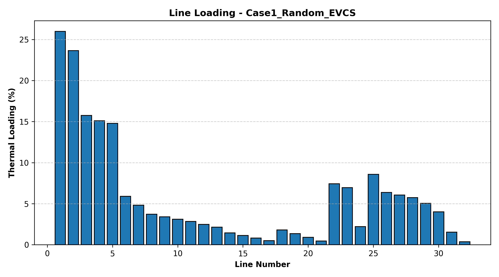
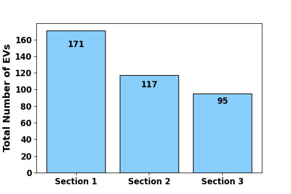
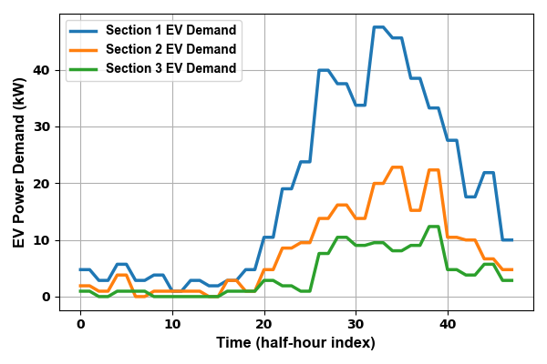

# AI-Based Power System Analytics Dashboard for EV Integration

This project presents an AI-driven framework for analysing the impact of Electric Vehicle (EV) integration on power distribution networks. It combines machine learning, probabilistic modelling, and power system simulation to assess EV charging demand and its impact on network performance.

The model integrates:
- Feature importance analysis of EV market data
- EV classification using clustering techniques
- Probabilistic EV demand modelling using Monte Carlo simulation
- Network impact analysis on the IEEE 33-bus distribution system

This project bridges research and industry applications for DER integration, hosting capacity assessment, and network planning.

---

## Key Features

- 📊 Feature Importance Analysis using Random Forest
- 🔍 EV Segmentation using K-Means Clustering
- 🎲 Monte Carlo Simulation for EV Charging Behaviour
- ⚡ EV Load Modelling considering uncertainty
- 🏗️ IEEE 33-Bus Network Modelling using Pandapower
- 📉 Voltage Profile Analysis
- 🔋 Power Loss Evaluation
- 🔌 EV Charging Station Integration
- 🔋 Battery Storage Integration
- 📈 Scenario-based Impact Assessment

---

## Methodology

The framework consists of four major stages:

### 1. EV Market Analysis
- Random Forest Regressor used to identify key factors affecting EV price
- Features include:
  - Battery Capacity
  - Driving Range
  - Vehicle Type

### 2. EV Clustering
- K-Means clustering used to group EVs into categories
- Optimal number of clusters determined using:
  - Elbow Method
  - Silhouette Score

### 3. Probabilistic EV Demand Modelling
- Monte Carlo Simulation used to model uncertainties:
  - Arrival Time
  - State of Charge (SOC)
  - Driving Distance
  - Charging Power Level
   IEEE 33-bus distribution network developed in       Pandapower
- EV loads integrated into the network
- Generates hourly and half-hourly EV load profiles

### 4. Power System Impact Analysis
- Multiple scenarios analysed:
  - Base Case
  - EV Charging Load
  - EV + Battery Storage
  - Optimal EV Placement
  - Optimal EV + Storage

---

## Project Structure

```
ev-hosting-capacity-ml-mcs-ieee33/
│
├── data/
│   ├── Feature_Importance.xlsx
│   ├── kmeansEVs.xlsx
│
├── src/
│   ├── 01_feature_importance.py
│   ├── 02_kmeans_clustering.py
│   ├── 03_ieee33_evdemand_section.py
│   └── 04_scenario_impact_analysis.py
│
├── results/
│   ├── figures/
│   └── outputs/
│
├── main.py
├── requirements.txt
└── README.md

```
Excel files in data/

Move these into data/:

Feature Importance.xlsx

kmeansEVs.xlsx

Create Python files in src/

Create these files:

01_feature_importance.py (RandomForest + plot)

02_kmeans_clustering.py (Elbow + silhouette + clusters)

03_ieee33_evdemand_section.py (IEEE 33 bus base network+ uncertainties + EV profiles)

04_scenario_impact_analysis.py (EVCS/storage cases + voltages + losses + line loading)

Important: In each file, at the top save figures into results/figures

     


## Relevance to Industry

This framework aligns with modern power system challenges in the Australian National Electricity Market (NEM), particularly:

- High penetration of rooftop PV and EVs  
- Increasing demand-side flexibility  
- Need for data-driven planning approaches  
- Transition towards smart grids and digital twins  

It is directly relevant for:

- Distribution Network Service Providers (DNSPs)  
- Transmission Network Service Providers (TNSPs)  
- System operators (AEMO)  
- DER and EV integration studies  
- Research and advanced planning tools  

---

## Future Extensions

The framework can be extended to include:

- Time-series power flow simulations  
- Dynamic Operating Envelope (DOE) calculations  
- Transmission–distribution coordination  
- Integration with real-world datasets (e.g., NEM data)  
- Forecasting models (load, PV, EV demand)  
- Real-time dashboards using FastAPI and React  


**This github codes used in the part of following research papers:**
1. Karmaker, A.K., Behrens, S., Sturmberg, B. and Pota, H., 2025, July. Fair Capacity Distribution in Public EV Charging Stations Using Participatory Approach. In 2025 IEEE Power & Energy Society General Meeting (PESGM) (pp. 1-5). IEEE.
2. Karmaker, A.K., Sturmberg, B., Behrens, S., Hossain, M.J. and Pota, H., 2023, December. Characterizing electric vehicle plug-in behaviors using customer classification approach. In 2023 IEEE International Conference on Energy Technologies for Future Grids (ETFG) (pp. 1-6). IEEE.
3. Karmaker, A.K., Sturmberg, B., Behrens, S., Hossain, M.J. and Pota, H.R., 2025. Community-based electric vehicle charging station allocation using regional customer diversities. IEEE Transactions on Industry Applications.
4. Karmaker, A.K., Du, Y., Behrens, S. and Pota, H., 2025. Enhancing electric vehicle hosting capabilities using strategic allocation of charging stations and energy storage systems. Journal of Energy Storage, 135, p.118095.

## Author
Dr Ashish Kumar Karmaker
Research Engineer, James Cook University, Cairns, AU